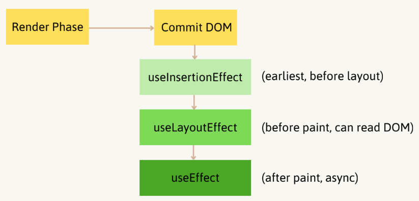
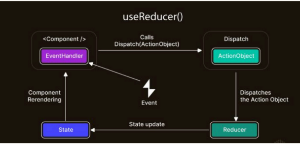
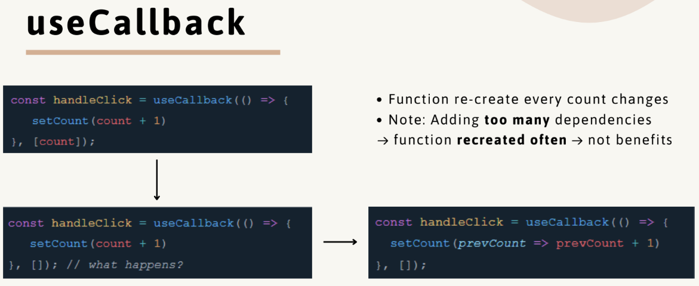
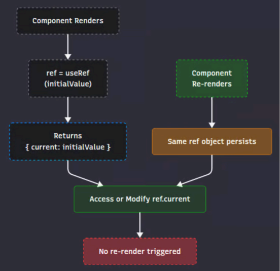
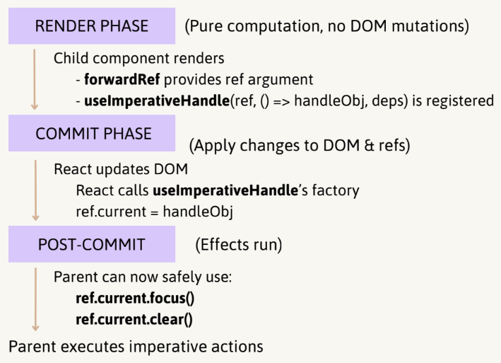

# React Hooks

## 0. Hook rules

- Only call Hooks at the top level.
  - Not inside loops, conditions, or nested functions.
- Only call Hooks from React functions.
  - Functional components or custom hooks.
- Hooks are stored in a **linked list** internally per component fiber.
  - React expects the **same order** on every render.

## 1. useState

- Used to declare state in functional components.
- Returns a pair: [value, setValue].
- Helps component "remember" data between renders.
  _Batch updates in React 18_

## 2. useEffect

- Used to handle side effects in functional components:
  - Fetching APIs.
  - DOM manipulation.
  - Subscriptions (WebSocket, event listener).
- Runs after render.
- Dependencies:
  - **array** of tracking values.
  - **empty []** -> run once after mount.
  - **omitted** -> run every render.
- Corresponds to the life cycle of the class component:
  - componentDidMount -> useEffect(() => {}, []);
  - componentDidUpdate -> useEffect(() => {}, [deps]);
  - componentWillUnmount -> cleanup return function
- Avoid infinite running -> must declare **dependency** array correctly.
- Cleanup: **timer**, **subscription**, **listener**.
- Dependency is **object/array** -> **cause re-rerun continuously**.

### Race condition

- User quickly changes from userId = 1 -> userId = 2
- Request 1 and request 2 are both sent.
- If request 1 returns slower than request 2, the state is updated with old data (wrong profile).

```jsx
function UserProfile({ userId }) {
  const [user, setUser] = useState(null);

  useEffect(() => {
    fetch(`/api/users${userId}`)
      .then((res) => res.json())
      .then((data) => setUser(data));
  }, [userId]);

  return <div>{user ? user.name : "Loading..."}</div>;
}
```

Solution:

- Use the **ignore** flag.
- Cancel old request, keep only latest request result with AbortController.
- React query, Apollo,...

```jsx
function UserProfile({ userId }) {
  const [user, setUser] = useState(null);

  useEffect(() => {
    let ignore = false;
    fetch(`/api/users${userId}`)
      .then((res) => res.json())
      .then((data) => {
        if (!ignore) setUser(data);
      });

    return () => {
      ignore = true;
    };
  }, [userId]);

  return <div>{user ? user.name : "Loading..."}</div>;
}
```

### Async

- Effects **do not** support async directly.

```jsx
useEffect(async () => {...}, [...]); // do not support
```

- Callback returns **void**, not promise.
- Race condition & memory leak:
  - Component **unmounts** or **dependency changes**
    -> Old effect is still running
    -> State may ne updated incorrectly (updated to unmounted component).

```jsx
function UserProfile({ userId }) {
  const [user, setUser] = useState(null);

  useEffect(() => {
    let ignore = false;
    async function fetchData() {
      const res = await fetch("/api");
      if (!ignore) setUser(await res.json());
    }
    fetchData();
    return () => {
      ignore = true;
    };
  }, [userId]);

  return <div>{user ? user.name : "Loading..."}</div>;
}
```

## 3. useLayoutEffect

- **Synchronously** after DOM mutations and before browser paint.
- Guarantees the DOM is ready, but the user has not seen it yet.

_Render -> Layout Effect -> Paint -> Effect_

- React render -> React builds/updates the virtual DOM.
- Commit DOM updates -> DOM is updated with new changes.
- useLayoutEffect fires (synchronously, block paint until finished).
  - Can measure DOM and update state without flicker.
- Browser paints screen (user sees UI).
- useEffect fires (asynchronously, after paint).

### useEffect vs useLayoutEffect

| Feature          | `useEffect`                  | `useLayoutEffect`              |
| :--------------- | :--------------------------- | :----------------------------- |
| **Runs**         | After paint (async)          | Before paint (sync)            |
| **Blocks paint** | ❌ No                        | ✅ Yes                         |
| **Common use**   | Fetch, subscriptions, timers | DOM measurement, sync layout   |
| **Risk**         | Flicker when updating layout | Performance issues if overused |

## 4. useInsertionEffect

- **Before** any DOM mutations are painted.
- **Inserting styles** into the DOM.



- Control **low-level rendering** (like a CSS-in-JS library).

```javascript
function styled(tag: any, styles: any) {
  return function StyledComponent(props: any) {
    const className = "sc-" + Object.keys(styles).join("-");
    useInsertionEffect(() => {
      const styleEl = document.createElement("style");
      styleEl.setAttribute("data-sc", className);
      styleEl.textContent = `
        .${className} {
          ${Object.entries(styles)
            .map(([k, v]) => `${k}: ${v};`)
            .join("\n")}
        }
      `;
      document.head.appendChild(styleEl);
      return () => {
        document.head.removeChild(styleEl);
      };
    }, [className]);
    return React.createElement(tag, { ...props, className }, props.children);
  };
}
```

## 5. useReducer

```javascript
function TestComponent(tag: any, styles: any) {
  const [loading, setLoading] = useState(false);
  const [error, setError] = useState(null);
  const [data, setData] = useState(null);
  ...
}
```

Current useState problems:

- Complex state logic: nested updates,...
- Manually merge the previous state.
- Logic is not centralized.



- **Predictable state transitions**: Logic grouped into one reducer
  -> easier to debug than scattered useState calls.
- **Scalability**: state updates follow a well-defined set of actions.

```javascript
const initialState = { loading: false, error: null, data: null };
function reducer(state, action) {
  switch (action.type) {
    case "FETCH_START":
      return { ...state, loading: true, error: null };
    case "FETCH_SUCCESS":
      return { ...state, loading: false, data: action.payload };
    case "FETCH_ERROR":
      return { ...state, loading: false, error: action.error };
    default:
      return state;
  }
}
```

### Action payload design patterns:

- Flux/Redux style - { type, payload }:
  - dispatch({ type: "ADD", payload: { id: 1, text: "test" } });
- Command style - structured action objects for clarity:
  - dispatch({ type: "ADD", id: 1, text: "test" });
- Tuple style - arrays [type, payload]:
  - dispatch(["ADD", { id: 1, text: "test" }]);

### Lazy initialization

```javascript
function init(initialCount) {
  return { count: initialCount, double: initialCount * 2 };
}
function reducer(state, action) {
  switch (action.type) {
    case "increment":
      return { ...state, count: state.count + 1 };
    default:
      return state;
  }
}
const [state, dispatch] = useReducer(reducer, 0, init);
```

Sometimes initial state is **expensive to compute** (e.g., parsing localStorage)
-> **avoids recomputing** state on every render.

### Cons

- State updates can become scattered across the component.
- Logic is not centralized -> harder to reason about when state transitions grow.
- Each setState call must manually merge the previous state.

## 6. useMemo

- **Caches** the result of an **expensive calculation** (value).
- Avoid re-computing heavy logic on every render.
- If passing an **array/object**
  -> **re-render** every times parent renders because it creates new object/array.
- **useMemo** itself has a cost (stores + compares dependencies). Do not wrap everything -> only use for:
  - Expensive computations.
  - Stable references to prevent re-renders.
  - Large lists/derived state.

## 7. memo

- A **Higher-Order Component (HOC)** that memorizes the rendered output of a functional component.
- Prevents re-render if props are shallowly equal between renders.
- On re-render:
  - Compare **previous props vs next props** using **shallow comparison**.
  - If equal -> skips render, reuses previous result.
  - If not equal -> renders the component again.
- **Always re-renders**, because **{ id: 1 }** creates a new object reference every time.
- Solution: **useMemo / useCallback** for stable references.

### Performance silver bullet

- memo has a cost: React still does a props comparison.
- If comparison cost > re-render cost -> get **worst performance**.

```javascript
React.memo(Comp, (prevProps, nextProps) => {
  return true / false;
});

<ExpensiveChild data={{ id: 1 }} />;

const ExpensiveChild = React.memo(
  Child,
  (prevProps, nextProps) => prevProps.data.id === nextProps.data.id
);

const Child = React.memo(function Child({ value }) {
  console.log("render child");
  return <div>{value}</div>;
});
```

## 8. useCallback

- Memoizes a **function reference**.
- Prevent re-creating functions unnecessarily.
- Without dependencies, [] means Child component receives the **same reference every render**.



### When should to use

Example:

```jsx
function List({ items }) {
  const [selected, setSelected] = useState(null);
  const handleSelect = useCallback((id) => setSelected(id), []);
  return items.map((item) => (
    <Item key={item.id} onSelect={handleSelect} item={item} />
  ));
}
```

- Without _useCallback_: Each Item re-renders because _onSelect_ changes.
- With _useCallback_: Item props stay stable -> fewer re-renders.

### When should not to use

Example:

```jsx
function List({ items }) {
  const [selected, setSelected] = useState(null);
  const handleSelect = useCallback((id) => () => setSelected(id), []);
  return items.map((item) => (
    <Item key={item.id} onSelect={handleSelect(item.id)} />
  ));
}
```

- Stable outer function, closures created only once.
- **NOT** use:
  - non-memoized children -> no benefit.
  - dependencies change every render -> still new function each time -> no benefit.

## 9. useContext

- A component consumes the nearest provider value.
- **Avoid prop drilling** (prop needs to be passed through several layers of nested components).
- Can cause **performance bottlenecks** in large apps.
- Every consumer **re-renders** when user changes - even if they **do not use**.

### Best practices

#### 1. Memoizing provider value

- Prevents new object reference on every render.
- Reduces unnecessary renders.
- Component consumes **useContext**, updates **bypass memo** and force re-render.

```jsx
const App = memo(() => {
    return (
        <>
            <Header />
            <Sidebar />
            <Content />
        </>
    );
});

const ContextProvider = () => {
    const value = useMemo(() => ({ user, setUser }), [user]);
    return (
        <UserContext.Provider value={value}>
            <App />
        </serContext.Provider>
    );
};
```

#### 2. Split contexts

- Components that only need **value will not re-render** when setValue reference is stable.
- Components that only need **setValue will not re-render** when value changes.

```jsx
const StateContext = createContext({});
const DispatchContext = createContext({});

function Provider({ children }) {
  const [value, setValue] = useState(null);
  return (
    <StateContext.Provider value={value}>
      <DispatchContext.Provider value={setValue}>
        {children}
      </DispatchContext.Provider>
    </StateContext.Provider>
  );
}

function useValue() {
  return useContext(StateContext);
}

function useSetValue() {
  return useContext(DispatchContext);
}
```

#### 3. Advanced pattern: Context + useReducer = Scalable State management

- Combine **useReducer** with **useContext** to create a **Redux like global store** without installing Redux.

```jsx
const StoreContext = createContext({});

function StoreProvider({ children }) {
  const [state, dispatch] = useReducer(rootReducer, initialState);
  return (
    <StoreContext.Provider value={{ state, dispatch }}>
      {children}
    </StoreContext.Provider>
  );
}

// in components
const { state, dispatch } = useContext(StoreContext);
```

## 10. useId

- Unique and stable ID string (like htmlFor, aria-\*).
- Guarantees the DOM is ready, but the user has not seen it yet.
- **NOT usedId()** for keys in list.
- Each render generates new keys (e.g., :r1:, :r2:,...).
- React thinks all list items are different every render.
- Results:
  - Items always unmount/remount.
  - Lost input focus, lost animations, worse performance.

## 11. useRef

- **Persists across renders**.
- Updating **.current** does **NOT** cause re-renders.
- Usages:
  - Accessing DOM.
  - Mutable values: **prev.current** is set only once (initial render)
    -> updating it **does not cause re-render**.



```jsx
// Usage: track previous stable
// - On render: UI shows value and whatever is in prev.current.
// - After render: useEffect updates prev.current = value.
// - Next render: UI shows new value vs previous prev.current.
function Count({ value }) {
  const prevValue = useRef(null);

  useEffect(() => {
    prevValue.current = value;
  }, [value]);

  return (
    <p>
      Now: {value}, before: {prevValue.current}
    </p>
  );
}
```

```jsx
// Usage: Animation
// - Mutable object store inside React's internal fiber tree.
// - React does not "track" this mutation -> no reconciliation is triggered.
function Animation() {
  const frame = useRef();
  useEffect(() => {
    const loop = () => {
      frame.current = requestAnimationFrame(loop);
    };
    frame.current = requestAnimationFrame(loop);
    return () => cancelAnimationFrame(frame.current);
  }, []);
}
```

```jsx
// Usage: with Lists
// - itemsRef.current holds an array of DOM nodes.
// - ref={el => itemsRef.current[i] = el} assigns each <div> its ref.
// - scrollIntoView() is called imperatively on the selected DOM element.
// - No re-render happens when itemsRef.current changes.
function Lists() {
  const itemsRef = useRef([]);
  const scrollToItem = (index) => {
    itemsRef.current[items]?.scrollIntoView({
      behavior: "smooth",
      block: "center",
    });
  };
  return list.map((item) => (
    <div
      key={item.id}
      ref={(el) => {
        if (el) itemsRef.current[item.id] = el;
      }}
    >
      
    </div>
  ));
}
```

## 12. forwardRef

- Official React pattern.
- Imperative API (**useImperativeHandle**).
- Can **pass ref** as props
  - Parent must remember custom prop name.
  - Does not integrate with 3rd-party libs expecting refs.
- **forwardRef** allows a component to **expose its inner DOM node** (or imperative API) to its parent.

```jsx
function Lists() {
    const itemsRef = useRef([]);
    const scrollToItem = (index) => {
        itemsRef.current[items]?.scrollIntoView({
            behavior: "smooth",
            block: "center",
        });
    };
    return list.map(item => (
        <Item
            key={item.id}
            item={item}
            ref={el => {
                if (el) itemsRef.current[item.id] = el;
            }}
        />
    ));
}

const Item = forwardRef((({ item }), ref) => {
    return <div ref={ref}>{item.title}</div>;
});
```

## 13. useImperativeHandle

- **forwardRef**, the parent gets the **DOM node**.
- Do not want to expose the raw DOM node -> expose a **custom API**.
  - **useImperativeHandle** customize the value exposed to the parent.
- Why use **useImperativeHandle**?
  - Encapsulation: Parent does not know/care about internal DOM structure.
  - Abstraction: Provide only the methods want exposed.
  - Safety: Prevents misuse of raw DOM node.



## 14. useTransition

### Legacy Rendering

- All updates in React are considered urgent.

### Concurrent Rendering

- Mark state updates as **non-urgent**.
- Keeps UI responsive by prioritizing urgent updates.

```jsx
const [query, setQuery] = useState("");
const [filtered, setFiltered] = useState(items);
const [isPending, startTransition] = useTransition();

const handleChange = (e) => {
  const value = e.target.value;
  setQuery(value); // urgent -> renders input immediately

  startTransition(() => {
    const results = items.filter((item) => {
      item.toLowerCase().includes(value.toLowerCase());
    });
    setFiltered(results); // filter list (non-urgent)
  });
};
// without transition
// -> filter list is expensive update
// -> blocks typing until list finishes rendering
```

### useTransition vs debounce

Both `useTransition` and `debounce` are techniques used to delay heavy updates to keep the UI responsive and make interactions like typing/searching feel smoother, especially when handling big lists. However, they operate at different levels and have distinct characteristics.

| Feature                | `useTransition`                                                         | `debounce`                                                                 |
| :--------------------- | :---------------------------------------------------------------------- | :------------------------------------------------------------------------- |
| **Scheduling**         | Schedules update as non-urgent, runs ASAP when React is idle            | Waits for user to stop typing (time delay)                                 |
| **Mechanism**          | React Scheduler (automatic, frame-aware)                                | manual `setTimeout`                                                        |
| **Interruptibility**   | Interruptible - React can cancel/restart transitions if new input comes | Not Interruptible - once debounce timer starts, it always runs after delay |
| **Level of Operation** | Works at **render scheduling level**                                    | Works at **event handler level**                                           |

## 15. useDeferredValue

- **Defer updating a value** until React has time.
- Wrap a specific value.
- Keeps UI responsive by showing an older value until expensive rendering finishes.
- Re-render in the background with the new value.\
- React **finishes the original re-render**, will **immediately start working on the background re-render** with the new deferred value.
- Any updates caused by events (like typing) will interrupt the background re-render and get prioritized over it.

```jsx
const [query, setQuery] = useState("");
const deferredQuery = useDeferredValue(query);
const filtered = items.filter((item) =>
  item.toLowerCase().includes(deferredQuery.toLowerCase())
);
// setQuery input updates immediately (urgent)
// until React catches up -> deferredQuery = "value" -> filter, render list
```

- Passing raw objects/arrays will create a new value every render -> making deferral useless.

```jsx
const filters = useMemo(() => ({ sort, category }), [sort, category]);
const deferredFilters = useDeferredValue(filters);
```

### useDeferredValue vs useTransition

| Feature          | `useDeferredValue`               | `useTransition`                       |
| :--------------- | :------------------------------- | :------------------------------------ |
| **Scope**        | Single value                     | Batch update                          |
| **Use case**     | Defer rendering of derived value | Defer execution of `setState` updates |
| **Pending UI**   | No built-in pending flag         | Gives `isPending` boolean             |
| **Mental model** | Keep older version of a value    | Run these updates later               |

## 16. Custom hooks

- Sharing logic between components.
  - Each call to a Hook is completely independent from every other call to the same Hook.
- Starts with use (so React enforces hook rules).
  - Can call other hooks (useState, useEffect, useMemo, etc.)